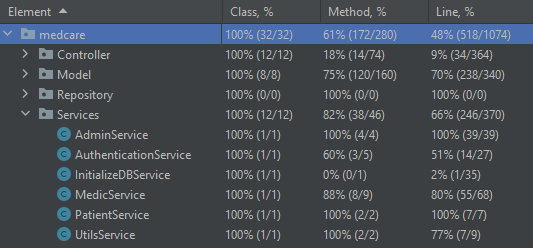

# Documentazione "Mentcare" 

(Alessandro Rodeghero VR474699)

## Introduzione
Il progetto scelto è il sistema informativo "MentCare" realizzato come una webApp con framework Java Spring con pattern architetturale MVC.

Ho aggiunto più requisiti e scenari del previsto per rendere il sistema più interattivo durante le varie prove.

## Requisiti
***
### Attori coinvolti nel sistema 
+ I pazienti devono essere aggiunti al sistema dall' amministratore, il quale fornisce loro le credenziali di accesso al sistema.
Una volta registrati, possono accedere usando le proprie credenziali.
+ I medici devono essere aggiunti al sistema dall' amministratore, il quale fornisce loro le credenziali di accesso al sistema.
  Una volta registrati, possono accedere usando le proprie credenziali.
+ L'amministratore è già registrato nel sistema, non è prevista la possibilità di aggiungere nuovi amministratori.
+ All'avvio dell'applicazione sono già presenti due pazienti, cinque medici e un amministratore. In particolare Mario.Rossi ha molte prescrizioni di più medici mentre Gino.Gialli una sola. Le credenziali sono le seguenti:
  + PAZIENTE: Username: "Mario.Rossi" Password: "" (stringa vuota)
  + PAZIENTE: Username: "Gino.Gialli" Password: "" (stringa vuota)
  + MEDICO: Username: "Dottor.Nullo" Password: "" (stringa vuota)
  + MEDICO: Username: "Dottor.Verdi" Password: "" (stringa vuota)
  + MEDICO: Username: "Dottor.Neri" Password: "" (stringa vuota)
  + MEDICO: Username: "Dottor.Viola" Password: "" (stringa vuota)
  + MEDICO: Username: "Dottor.Vuoto" Password: "" (stringa vuota)
  + ADMIN: Username: "super.user" Password: "" (stringa vuota)

La stringa vuota come password è stata impostata per un accesso più semplice durante l'esplorazione del sistema.
#### Paziente
1. Il paziente deve poter accedere alla propria area personale mediante le credenziali fornite.
   (Username = Nome.Cognome e password scelta dall' Amministratore di sistema in fase di registrazione del paziente)
2. Il paziente deve avere la possibilità di visualizzare le proprie informazioni personali.
3. Il paziente deve avere la possibilità di consultare la terapia prescritta, ovvero visualizzare la lista delle prescrizioni mediche per lui stabilite e per ognuna 
visualizzare il nome del medico prescrivente, farmaci prescritti, quantità e descrizione della prescrizione medica.

#### Medico

1. Il medico deve poter accedere alla propria area personale mediante le credenziali fornite.
   (Username = Dottor.Cognome e password scelta dall' Amministratore di sistema in fase di registrazione del medico)
2. Il medico deve avere la possibilità di visualizzare le proprie informazioni personali.
3. Il medico deve poter aggiungere una prescrizione ad un qualsiasi paziente registrato fornendo tutti i dettagli necessari alla prescrizione.
4. Il medico deve poter consultare la lista delle prescrizioni da lui stabilite con relativi dettagli, anche il nome del paziente in oggetto.
5. Il medico deve poter modificare le prescrizioni fornite ai pazienti.
6. Il medico deve poter cancellare le prescrizioni fornite ai pazienti.
 
#### Amministratore di sistema

1. L'amministratore deve poter accedere alla propria area personale mediante le credenziali fornite.
2. L'amministratore deve poter visualizzare tutti i pazienti memorizzati nel sistema.
3. L'amministratore deve poter visualizzare tutti i medici memorizzati nel sistema.
4. L'amministratore deve poter aggiungere nuovi pazienti al sistema inserendo le informazioni richieste.
5. L'amministratore deve poter aggiungere nuovi medici al sistema inserendo le informazioni richieste.
6. L'amministratore deve poter visualizzare e modificare le informazioni personali di ogni paziente memorizzato nel sistema.
7. L'amministratore deve poter visualizzare e modificare le informazioni personali di ogni medico memorizzato nel sistema.

## Scenari
***
### 1. Aggiunta Paziente

**Assunzione iniziale:** Perchè l' amministratore possa aggiungere un nuovo paziente è necessario che sia correttamente entrato nell' applicazione con le proprie credenziali.

**Normale:** L'amministratore vuole creare un nuovo paziente per registrarlo a sistema. Per fare ciò l' amministratore accede dal proprio menù alla sezione "All Patients" nella quale troverà il bottone "Add new patient" 
che a sua volta aprirà la pagina di inserimento dei dati del paziente. Una volta inseriti i dati del paziente richiesti, i dati verranno salvati così che l' utente
possa accedere al sistema tramite Log In.

**Problemi:** I problemi che si possono verificare in questa fase sono legati all' inserimento di dati non conformi agli standard del sistema.
In caso di input non accettabili, il sistema fornirà una stringa di errore specificando il campo non corretto e le indicazioni per una corretta compilazione. 
La registrazione non avverrà fino che tutti i campi inseriti non risultano accettabili per il sistema.

**Stato del sistema al termine:** Il paziente è stato correttamente registrato nel sistema e potrà eseguire l'accesso tramite le 
credenziali fornite. Al termine dell'operazione , l' amministratore viene rimandato alla pagina con la lista dei pazienti "All Patients", dove potrà controllare l'avvenuta aggiunta del paziente controllando la lista.

### 2. Modifica Paziente

**Assunzione iniziale:** Perchè l' amministratore possa modificare un paziente, è necessario che sia correttamente entrato nell' applicazione con le proprie 
credenziali e che il paziente da modificare sia correttamente salvato nel sistema.

**Normale:** L'amministratore vuole modificare delle informazioni di un paziente in modo da aggiornare o correggere quelle già presenti. 
Per fare ciò l' amministratore accede dal proprio menù alla sezione "All Patients" e seleziona il campo "edit" presente nella riga della 
tabella associata al paziente da modificare. A sua volta aprirà la pagina di modifica dati del paziente.
Una volta modificati i dati desiderati, questi verranno salvati nel sistema.

**Problemi:** I problemi che si possono verificare in questa fase sono legati all' inserimento di dati non conformi agli standard del sistema.
In caso di input non accettabili, il sistema fornirà una stringa di errore specificando il campo non corretto e le indicazioni per una corretta compilazione.
La modifica non avverrà fino che tutti i campi inseriti non risultano accettabili per il sistema.

**Stato del sistema al termine:** Il paziente è stato correttamente modificato nel sistema e le modifiche saranno visibili da
tutti gli utenti che hanno la possibilità di visualizzare tali informazioni, ovvero il paziente stesso, i medici e gli 
amministratori.

### 3. Aggiunta Medico

**Assunzione iniziale:** Perchè l'amministratore aggiungere un nuovo medico è necessario che sia correttamente entrato nell' applicazione con le proprie credenziali.

**Normale:** L'amministratore vuole creare un nuovo medico per registrarlo a sistema. Per fare ciò l' amministratore accede dal proprio menù alla sezione "All Medics" nella quale troverà il bottone "Add new medic" che a sua volta aprirà la pagina di inserimento dei dati del medico. Una volta inseriti i dati del medico richiesti, i dati verranno salvati così che l' utente
possa accedere al sistema tramite Log In.

**Problemi:** I problemi che si possono verificare in questa fase sono legati all' inserimento di dati non conformi agli standard del sistema.
In caso di input non accettabili, il sistema fornirà una stringa di errore specificando il campo non corretto e le indicazioni per una corretta compilazione.
La registrazione non avverrà fino che tutti i campi inseriti non risultano accettabili per il sistema.

**Stato del sistema al termine:** Il medico è stato correttamente registrato nel sistema e potrà eseguire l'accesso tramite le
credenziali fornite. Al termine dell'operazione , l' amministratore viene rimandato alla pagina con la lista dei medici "All Medics", dove potrà controllare l'avvenuta aggiunta del medico controllando la lista.

### 4. Modifica Medico

**Assunzione iniziale:** Perchè l' amministratore possa modificare un medico, è necessario che sia correttamente entrato nell' applicazione con le proprie
credenziali e che il medico da modificare sia correttamente salvato nel sistema.

**Normale:** L'amministratore vuole modificare delle informazioni di un medico in modo da aggiornare o correggere quelle già presenti.
Per fare ciò l' amministratore accede dal proprio menù alla sezione "All Medics" e seleziona il campo "edit" presente nella riga della
tabella associata al medico da modificare. A sua volta aprirà la pagina di modifica dati del medico.
Una volta modificati i dati desiderati, questi verranno salvati nel sistema.

**Problemi:** I problemi che si possono verificare in questa fase sono legati all' inserimento di dati non conformi agli standard del sistema.
In caso di input non accettabili, il sistema fornirà una stringa di errore specificando il campo non corretto e le indicazioni per una corretta compilazione.
La modifica non avverrà fino che tutti i campi inseriti non risultano accettabili per il sistema.

**Stato del sistema al termine:** Il medico è stato correttamente modificato nel sistema e le modifiche saranno visibili da
tutti gli utenti che hanno la possibilità di visualizzare tali informazioni, ovvero il medico stesso, gli amministratori e i pazienti. (i pazienti vedono solo il nome del medico prescrivente e non i suoi dati completi)

### 5. Aggiunta prescrizione

**Assunzione iniziale:** Perchè il medico possa aggiungere una prescrizione ad un paziente è necessario che il medico sia
correttamente entrato nell' applicazione con le proprie credenziali e che l'utente sia registrato a sistema.

**Normale:** Il medico vuole aggiungere una prescrizione ad un paziente. Per fare ciò il medico accede dal proprio menù alla sezione "Add Prescriptions" 
la quale presenterà al medico la lista di tutti i pazienti registrati a sistema. Premendo sul link "add prescription" presente nella 
stessa riga della tabella del paziente desiderato, si aprirà la pagina per l'inserimento dei dati della nuova prescrizione.
Una volta inseriti i dati desiderati, questi verranno salvati nel sistema.

**Problemi:** I problemi che si possono verificare in questa fase sono legati all' inserimento di dati non conformi agli standard del sistema.
In caso di input non accettabili, il sistema fornirà una stringa di errore specificando il campo non corretto e le indicazioni per una corretta compilazione.
L'aggiunta' non avverrà fino che tutti i campi inseriti non risultano accettabili per il sistema.

**Stato del sistema al termine:** La prescrizione viene correttamente aggiunta nel sistema e potrà
essere visualizzata da tutti gli utenti che hanno il diritto di accedere a tali informazioni.
Il medico potrà verificare l'operazione effettuata consultando la lista delle prescrizioni da lui stabilite nella sezione "Prescriptions".
Il paziente potrà vedere le proprie prescrizioni nella sezione "Terapy" del proprio menù.

### 6. Modifica/Cancellazione prescrizione

**Assunzione iniziale:** Perchè il medico possa modificare una prescrizione ad un paziente è necessario che il medico sia
correttamente entrato nell' applicazione con le proprie credenziali, che l'utente sia registrato a sistema e che la prescrizione 
da modificare sia già memorizzata a sistema.

**Normale:** Il medico vuole modificare una prescrizione ad un paziente. Per fare ciò il medico accede dal proprio menù alla sezione "Prescriptions"
il quale presenterà al medico la lista di tutte le prescrizioni da lui stabilite. Premendo sul link "edit" presente nella
stessa riga della tabella della prescrizione da modificare, si aprirà la pagina per l'inserimento dei nuovi dati della prescrizione.
Una volta inseriti i dati desiderati, questi verranno salvati nel sistema.
Volendo invece cancellare una prescrizione si preme sul tasto "delete" presente a fianco del tasto "edit". 
Premendo "delete" la prescrizione viene cancellata dal sistema.

**Problemi:** I problemi che si possono verificare in questa fase sono legati all' inserimento di dati non conformi agli standard del sistema.
In caso di input non accettabili, il sistema fornirà una stringa di errore specificando il campo non corretto e le indicazioni per una corretta compilazione.
La modifica non avverrà fino che tutti i campi inseriti non risultano accettabili per il sistema.

**Stato del sistema al termine:** La prescrizione viene correttamente modificata e potrà essere visualizzata da tutti gli utenti 
che hanno il diritto di accedere a tali informazioni.
Il medico potrà verificare l'operazione effettuata consultando la lista delle prescrizioni da lui stabilite 
nella sezione "Prescriptions" controllando la modifica/eliminazione.
Il paziente potrà consultare la modifica/eliminazione nella sezione "Terapy" del proprio menù.

### 7. Visualizzazione dei farmaci prescritti (Paziente)

**Assunzione iniziale:** Perchè il paziente possa visualizzare le proprie prescrizioni è necessario che abbia effettuato correttamente l'accesso al sistema.

**Normale:** Il paziente che vuole vedere i farmaci prescritti può accedere alla sezione "Terapy" dal proprio menù.
In questa pagina può controllare tutte le prescrizioni a lui associate con i dettagli di farmaco prescritto, quantità, descrizione, data e medico che ha aggiunto la prescrizione.

**Problemi:** /

**Stato del sistema al termine:** Al termine dell' operazione, l'applicazione mostrerà le prescrizioni associate al paziente
che sono state trovate nella memoria del sistema.

### 8. Visualizzazione dei farmaci prescritti (Medico)

**Assunzione iniziale:** Perchè il medico possa visualizzare le prescrizioni che ha stabilito, è necessario che abbia effettuato correttamente l'accesso al sistema.

**Normale:** Il medico che vuole vedere le prescrizioni stabilite può accedere alla sezione "Prescriptions" dal proprio menù.
In questa pagina può controllare tutte le prescrizioni con i dettagli di farmaco prescritto, quantità, descrizione, data e paziente in oggetto.

**Problemi:** /

**Stato del sistema al termine:** Al termine dell' operazione, l'applicazione mostrerà le prescrizioni associate al medico che sono 
state trovate nella memoria del sistema.

### 9. Visualizzazione delle proprie informazioni(Paziente/Medico)

**Assunzione iniziale:** Perchè l'utente possa visualizzare le proprie informazioni, è necessario che abbia effettuato l'accesso correttamente al sistema.

**Normale:** L'utente che vuole visualizzare le proprie informazioni deve accedere alla sezione "Profile infos" la quale presenterà 
all'utente tutte le informazioni a lui legate.

**Problemi:** /

**Stato del sistema al termine:** Al termine dell' operazione applicazione mostrerà le informazioni associate all'utente
che sono state trovate nella memoria del sistema.

### 10. Login(Paziente/Medico/Amministratore)

**Assunzione iniziale:** Perchè l'utente possa effettuare il login con le proprie credenziali, è necessario che sia già 
registrato a sistema.

**Normale:** L'utente che vuole accedere inserisce le proprie credenziali nei rispettivi campi e, nel caso di paziente/medico, 
seleziona il radio button relativo al proprio ruolo. Premendo su "Submit" si presenterà all'utente la schermata Home.

**Problemi:** In caso il cui le credenziali non risultassero corrette, il sistema notificherà il problema con un messaggio di errore.

**Stato del sistema al termine:** Al termine dell' operazione l' applicazione mostrerà la pagina Home dell'utente.

# Guida
Per avviare l'applicazione:
1. Eseguire il main ServingWebContentApplication (contentuto in java.medcare.Controller)
2. Collegarsi a "http://localhost:8080/login" oppure "http://localhost:8080" per accedere come medico o paziente.
3. Collegarsi a "http://localhost:8080/admin_login" per accedere come admin.
3. Per effettuare il login, sono già stati memorizzati i seguenti utenti: 
   + PAZIENTE: Username: "Mario.Rossi" Password: "" (stringa vuota)
   + PAZIENTE: Username: "Gino.Gialli" Password: "" (stringa vuota)
   + MEDICO: Username: "Dottor.Nullo" Password: "" (stringa vuota)
   + MEDICO: Username: "Dottor.Verdi" Password: "" (stringa vuota)
   + MEDICO: Username: "Dottor.Neri" Password: "" (stringa vuota)
   + MEDICO: Username: "Dottor.Viola" Password: "" (stringa vuota)
   + MEDICO: Username: "Dottor.Vuoto" Password: "" (stringa vuota)
   + ADMIN: Username: "super.user" Password: "" (stringa vuota)

# Test

+ Unit Test: realizzati utilizzando il framework JUnit per testare le singole unità dell' applicazione. 
I test condotti sono focalizzati soprattutto sulle classi Service che forniscono ai Controller i metodi che eseguono varie operazioni.
Eseguire i test con l'applicazione non attiva. 

    Lo strumento per analizzare il livello di coverage è "IntelliJ Coverage". I test condotti riportano i seguenti risultati:

I metodi non testati sono astrazioni di query al database che vengono condiderate corrette così 
come metodi per la gestione dei Cookies e i vari Getter e Setter autogenerati.

+ Assurance Test: realizzati utilizzando Selenium WebDriver per testare l'interazione utente-sistema.
  I test realizzati riassumono le principali attività che i vari utenti possono svolgere nel sistema tramite interfaccia grafica.
  Richiedono l'avvio dell' applicazione prima dell' esecuzione dei test. Si consiglia di effettuare ogni assurance test
  con applicazione appena avviata così da non incombere in spiacevoli sequenze di test. Ad esempio, se venissero eseguiti in ordine
  i test modifica utente "TestEditPatient" e poi di login utente "TestLogin", quest'ultimo test potrebbe fallire se l'utente modificato è quello utilizzato per il
  test di login.
Per ogni scenario descritto precedentemente, è presente il corrispettivo assurance test.

1. Aggiunta Paziente: TestAddNewPatient
2. Modifica Paziente: TestEditPatient
3. Aggiunta Medico: TestAddNewMedic
4. Modifica Medico: TestEditMedic
5. Aggiunta prescrizione: TestMedicAddPrescription
6. Modifica/Cancellazione prescrizione: TestMedicEditPrescription, TestMedicDeletePrescription
7. Visualizzazione dei farmaci prescritti (Paziente): TestPatientPrescriptions
8. Visualizzazione dei farmaci prescritti (Medico): TestMedicInfo.testMedicPrescriptionList
9. Visualizzazione delle proprie informazioni(Paziente/Medico): TestPatientInfo, TestMedicInfo
10. Login(Paziente/Medico/Amministratore): TestLogin(Paziente/Medico), TestAdminLogin(Admin)
11. Altri test al di fuori degli scenari: 

    + TestAllMedicsPage, TestAllPatientsPage per accedere come amministratore 
    alle liste di medici e pazienti
    + TestMedicLogOut, TestPatientLogOut per testare il logout dal sistema.
